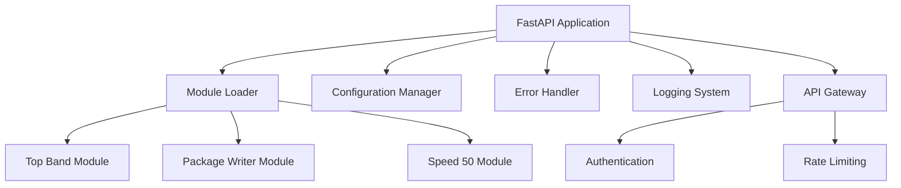
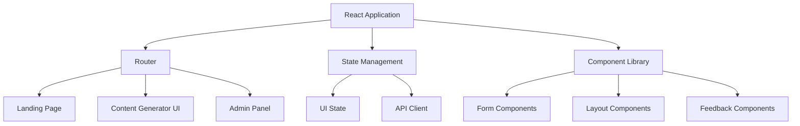

# Design Document

## Overview

This design document outlines the approach for transforming the Kannada AI Content Generator into a production-ready application with modern UI/UX design, a professional landing page, and improved code quality. The design focuses on creating a cohesive user experience while maintaining the application's core functionality for generating Kannada language news content.

## Architecture

The application will maintain its existing modular architecture with clear separation between frontend and backend components, but with several enhancements:

### Backend Architecture



### Frontend Architecture



## Components and Interfaces

### Backend Components

1. **Enhanced API Gateway**
   - Implement consistent error handling across all endpoints
   - Add request validation middleware
   - Implement rate limiting for API endpoints
   - Add detailed logging for all requests

2. **Improved Module Loader**
   - Enhanced error handling for module loading failures
   - Support for hot-reloading modules during development
   - Improved configuration validation

3. **Monitoring and Logging System**
   - Structured logging with severity levels
   - Performance metrics collection
   - Health check endpoints

### Frontend Components

1. **Landing Page**
   - Hero section with application overview
   - Feature highlights section
   - How-it-works section with visual guides
   - Call-to-action buttons to access generator tools
   - Responsive design for all device sizes

2. **Modernized Content Generator UI**
   - Tabbed interface for switching between generator types
   - Improved form components with validation
   - Loading states and animations
   - Result display with copy/export options
   - Error handling with user-friendly messages

3. **Enhanced Admin Panel**
   - Dashboard with system status and metrics
   - Module configuration interface
   - Log viewer component
   - User management (if applicable)

4. **Shared Component Library**
   - Button components with various states
   - Form input components with validation
   - Card components for content display
   - Modal and dialog components
   - Toast notification system
   - Loading indicators

### API Interfaces

The existing API endpoints will be maintained but enhanced with:

1. **Consistent Response Format**

   ```json
   {
     "success": true|false,
     "data": { ... },
     "error": { "code": "ERROR_CODE", "message": "Human readable message" },
     "meta": { "processingTime": "123ms" }
   }
   ```

2. **Enhanced Error Handling**
   - Detailed error codes and messages
   - Appropriate HTTP status codes
   - Validation error details

3. **New Health and Monitoring Endpoints**
   - `/health`: System health check
   - `/metrics`: Performance metrics (protected)

## Data Models

The existing data models will be maintained, with additions for:

1. **System Configuration**

   ```python
   class SystemConfig(BaseModel):
       modules: Dict[str, bool]
       api_rate_limits: Dict[str, int]
       log_level: str
       ui_settings: Dict[str, Any]
   ```

2. **User Preferences** (if user accounts are implemented)

   ```python
   class UserPreferences(BaseModel):
       language: str  # "en" or "kn"
       theme: str  # "light" or "dark"
       default_module: str
   ```

3. **Content Generation Request/Response Models**
   - Standardize request/response models across all generator modules
   - Add metadata fields for tracking and analysis

## UI/UX Design

### Design System

A comprehensive design system will be implemented with:

1. **Color Palette**
   - Primary: #3B82F6 (Blue)
   - Secondary: #10B981 (Green)
   - Accent: #8B5CF6 (Purple)
   - Neutrals: #1F2937, #4B5563, #9CA3AF, #E5E7EB, #F9FAFB
   - Error: #EF4444
   - Warning: #F59E0B
   - Success: #10B981

2. **Typography**
   - Primary Font: Inter (for English text)
   - Kannada Font: Noto Sans Kannada
   - Heading Sizes: 2rem, 1.5rem, 1.25rem, 1rem
   - Body Text: 1rem (16px)
   - Small Text: 0.875rem (14px)

3. **Component Styling**
   - Consistent border radius (0.375rem)
   - Consistent shadow styles
   - Hover and focus states for interactive elements
   - Animations for transitions and loading states

### Key UI Screens

1. **Landing Page**
   - Hero section with application name, tagline, and primary CTA
   - Feature cards highlighting the three main generators
   - How-it-works section with step-by-step illustrations
   - Footer with links and information

2. **Content Generator Interface**
   - Navigation tabs for different generator types
   - Input form with clear labels and validation
   - Generation options and parameters
   - Results display with formatting options
   - History of recent generations (if applicable)

3. **Admin Dashboard**
   - Overview metrics and system status
   - Module management interface
   - Configuration settings
   - Logs and error reports

### User Experience Flows

1. **First-time User Flow**

   ```mermaid
   graph LR
       A[Land on Homepage] --> B[View Feature Overview]
       B --> C[Select Generator Type]
       C --> D[View Generator Instructions]
       D --> E[Create First Content]
       E --> F[View/Copy Results]
   ```

2. **Regular User Flow**

   ```mermaid
   graph LR
       A[Land on Homepage] --> B[Go to Preferred Generator]
       B --> C[Input Content Parameters]
       C --> D[Generate Content]
       D --> E[View/Export Results]
       E --> F[Refine or Create New]
   ```

3. **Admin Flow**

   ```mermaid
   graph LR
       A[Access Admin Panel] --> B[View System Status]
       B --> C[Configure Modules]
       C --> D[Apply Changes]
       D --> E[Monitor System]
   ```

## Error Handling

1. **Frontend Error Handling**
   - Global error boundary for React components
   - API error handling with retry mechanisms
   - User-friendly error messages with recovery suggestions
   - Offline mode detection and handling

2. **Backend Error Handling**
   - Structured exception handling
   - Detailed logging of errors with context
   - Graceful degradation when modules fail
   - Custom exception classes for different error types

## Testing Strategy

1. **Backend Testing**
   - Unit tests for all modules and core functionality
   - Integration tests for API endpoints
   - Performance tests for content generation
   - Configuration validation tests

2. **Frontend Testing**
   - Component unit tests with React Testing Library
   - Integration tests for key user flows
   - Accessibility testing
   - Cross-browser compatibility testing

3. **End-to-End Testing**
   - Key user journeys tested with Cypress or similar
   - Performance and load testing

## Internationalization

1. **Language Support**
   - English UI with complete Kannada translation
   - Language detection based on browser settings
   - Language toggle in UI
   - Separate translation files for easy maintenance

2. **Content Handling**
   - Proper font loading for Kannada text
   - RTL/LTR support as needed
   - Proper text rendering and spacing

## Performance Optimization

1. **Frontend Performance**
   - Code splitting and lazy loading
   - Asset optimization (images, fonts)
   - Caching strategies
   - Performance monitoring with Web Vitals

2. **Backend Performance**
   - Request caching where appropriate
   - Database query optimization
   - Asynchronous processing for long-running tasks
   - Resource pooling

## Deployment Strategy

1. **Development Environment**
   - Local development setup with hot reloading
   - Docker-based development environment

2. **Production Environment**
   - Containerized deployment with Docker
   - Environment-specific configuration
   - Health monitoring and automated restarts
   - Backup and recovery procedures

## Security Considerations

1. **API Security**
   - Input validation and sanitization
   - Rate limiting and throttling
   - Authentication for admin endpoints
   - CORS configuration

2. **Application Security**
   - Dependency scanning and updates
   - Secure configuration management
   - Protection against common web vulnerabilities
   - Regular security audits
